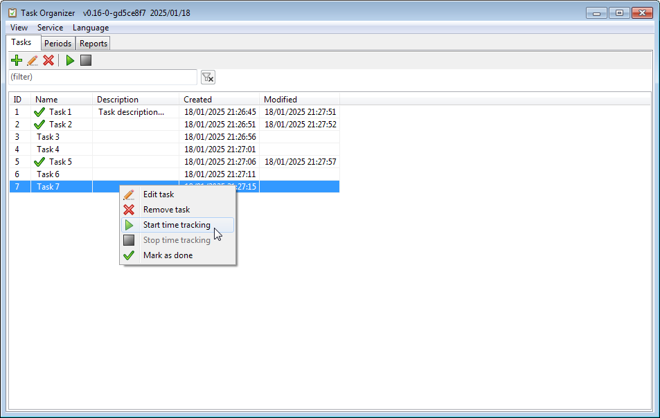
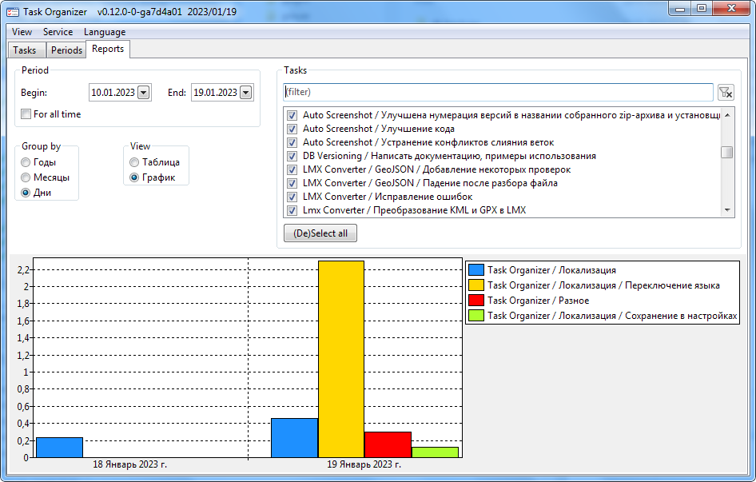

[](https://github.com/artem78/TaskOrganizer/releases/latest)
[](https://github.com/artem78/TaskOrganizer/blob/master/LICENSE.txt)


[](https://github.com/artem78/TaskOrganizer/releases/latest)

Program for managing tasks written in Lazarus IDE (Free Pascal).





Still work in progress, but some features already implemented:
- Time tracking
- Marking tasks as completed
- Statistics / report
- Export database to XML
- Filter tasks by name

# Windows builds

https://github.com/artem78/TaskOrganizer/releases

# Build manually

Currently only M$ Windows is supported.

You need to have [Free Pascal Compiler (FPC) and Lazarus IDE](https://www.lazarus-ide.org/) installed.

Clone repository with all submodules:

```
git clone https://github.com/artem78/TaskOrganizer.git --recurse-submodules
```

Install additional packages:

- From `packages` directory:
  - LazTrayIconExtended/trayiconexlazpkg.lpk
  - treelistview/treelistviewpackage.lpk
- From online package manager in IDE:
  - UniqueInstance

[Download SQlite3 library](https://www.sqlite.org/download.html) and put \*.dll to main Lazarus root directory and project directory.

Compile in IDE or from command line:

```
"c:/path/to/lazarus/lazbuild.exe" TaskOrganizer.lpi
```

Enjoy!
